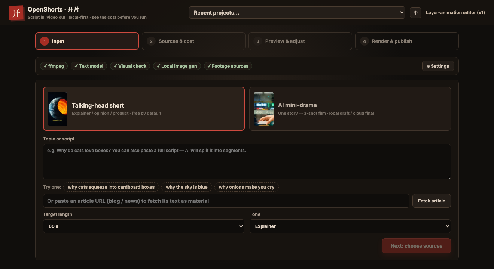
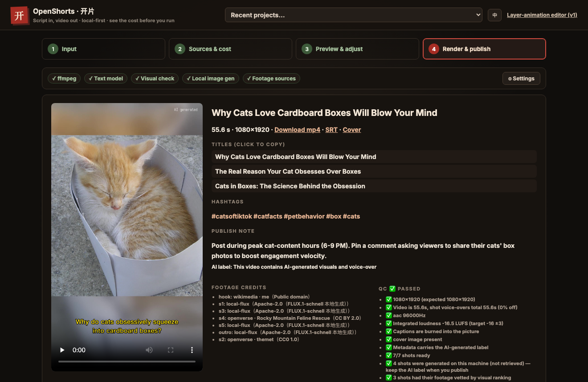

# OpenShorts · 开片

**Copy in, video out.** A local-first, open-source short-video production line: give it a topic and it writes the script, finds the footage, voices it, burns in subtitles, and hands you a finished video plus publish copy — **the first video costs $0 by default**, and it tells you cost and wait time *before* running.

<table align="center">
<tr>
<td width="50%" valign="middle" align="center">
<a href="docs/cases/koubo-en-cat-box/"></a><br>
<b>Why cats squeeze into boxes</b><br>
<sub>English pipeline · 56s · script, voice and captions all English</sub>
</td>
<td width="50%" valign="middle" align="center">
<a href="docs/cases/koubo-onion/"></a><br>
<b>Why do onions make you cry (zh)</b><br>
<sub>60s · $0, 0 paid keys · 2 of 6 shots painted on-device</sub>
</td>
</tr>
<tr>
<td width="50%" valign="middle" align="center">
<a href="docs/cases/koubo-compass/"></a><br>
<b>A compass doesn't point north (zh)</b><br>
<sub>43s · every stock candidate for 5 of 7 shots was rejected, then painted locally</sub>
</td>
<td width="50%" valign="middle" align="center">
<a href="docs/cases/drama-convenience-store/"></a><br>
<b>Late-night convenience store</b><br>
<sub>AI mini-drama · on-device sd.cpp draft tier · $0</sub>
</td>
</tr>
</table>

<p align="center"><sub>All four were actually produced by OpenShorts. Click a clip for its case study — the model's own words, footage credits, the quality check, and which shots fell short.</sub></p>
<p align="center"><b><a href="https://jnmetacode.github.io/openshorts/en/">🌐 Website · watch real output</a></b> · <a href="https://github.com/jnMetaCode/openshorts/releases">Download release</a> · <a href="README.md">中文文档</a></p>

    

```bash
git clone https://github.com/jnMetaCode/openshorts.git
cd openshorts && npm install
npm run openshorts      # opens the GUI at http://127.0.0.1:4174
```

Requires Node.js 20+ and FFmpeg (an npm package is coming; until then use the source checkout or a [release bundle](https://github.com/jnMetaCode/openshorts/releases)). **Run `openshorts doctor` right after installing** — it tells you what this machine can produce today and exactly what is missing.

> **Note**: the GUI has an English toggle (the EN button top-right, or open with `?lang=en`). With it on, the whole talking-head line runs in English — script, voice, word-aware captions, render log, errors, quality notes and the publish pack. The CLI speaks your system locale too — force it with `OPENSHORTS_LANG=en` (or `zh`). Still Chinese: live log lines coming from the AO engine subprocess, and the AI mini-drama line (it runs on a Chinese workflow, so its script is Chinese).

## Two pipelines

**Narrated explainers** — script → free Edge TTS voice-over → CC stock footage → burned-in subtitles → itemized QC. Runs end-to-end on **$0 and zero keys**. When stock libraries have nothing for your topic, it **paints a frame locally** (FLUX.1-schnell, Apache-2.0, commercial use OK) instead of shrugging in unrelated footage.

**AI mini-drama** — a story → 3-shot screenplay → character sheet → image-to-video ×3 → vision-model acceptance → composite. Draft on the **free local tier** (MiniMax-H3 via stable-diffusion.cpp on your own machine), then re-render the same script on a cloud tier — per-second billing, quoted before you run. Unhappy with one shot? **Redo just that shot** with feedback; everything else is reused byte-for-byte.

## What makes it different

| You care about | OpenShorts |
|---|---|
| First-video cost | **$0, zero keys**: CC footage + Edge TTS + local ffmpeg. A free Pexels key upgrades you to real stock video |
| Stock has nothing | Paints a frame on-device (free, offline) — onions and abstract concepts aren't in stock libraries anyway |
| Who reviews visuals | A vision model scores every candidate 0–10 (**≥6 leads, 4–5 fills, <4 rejected**); unjudged footage never ships |
| Output quality | Itemized QC — resolution, duration drift, audio, burned subtitles, loudness. **A fail exits non-zero**; a bad video never pretends to be good |
| Changing one line | Fingerprint-level reuse: only the changed shot is redone — voice, footage and rendered segments are content-addressed |
| Attribution | Per-shot source / author / license / URL, auto-appended to publish copy; AI-generated frames labeled |
| Knowing cost upfront | Quotes by provider / tier / seconds before running; the free path's `estimate` reports *time*, since money is always zero |

## What it looks like

Four steps to a video: **Input → Sources & cost → Preview & adjust → Render & publish**. A single row at the
top answers "what can this machine do right now"; model configuration lives behind **⚙ Settings**
(the script model and the visual-check model — both are tested with a real request before they are saved).

<table>
<tr>
<td width="50%" valign="top"><a href="docs/assets/ui/en-input.png"></a><br>
<b>① Input</b><br><sub>Give it a topic, paste a whole script, or drop in an article link and let it fetch the text. Target length and tone are optional.</sub></td>
<td width="50%" valign="top"><a href="docs/assets/ui/en-final.png"></a><br>
<b>④ Render &amp; publish</b><br><sub>Video, SRT and cover in one go; click a title to copy it; <b>every clip's author and licence is listed</b> (CC BY-SA requires the credit). The quality check states facts only — resolution, length drift, loudness, whether subtitles were burned in, the AI label, how many shots were generated locally and how many were vetted by the visual check. Then it builds a publish pack per platform — <b>it never auto-posts</b>.</sub></td>
</tr>
</table>

> The interface has an English toggle (**EN** in the top bar, or open with `?lang=en`). Open an English
> project while the interface is Chinese and it offers to switch for you.

## Real output

| Video | Pipeline | Length | Case study |
| --- | --- | --- | --- |
| *Why do onions make you cry* | Narrated · CC stock + **local FLUX frames** · vision gatekeeping · **$0, 0 keys** | 60s | [docs/cases/koubo-onion](docs/cases/koubo-onion/) |
| *Why cats squeeze into boxes* | Narrated · **the English pipeline** — script, voice, word-aware captions and publish pack all English | 56s | [docs/cases/koubo-en-cat-box](docs/cases/koubo-en-cat-box/) |
| *A compass does not point north* (zh) | Narrated · **5 of 7 shots had every stock candidate rejected** by the visual check → painted locally · **$0, 0 keys** | 43s | [docs/cases/koubo-compass](docs/cases/koubo-compass/) |
| *Why cats love boxes* | Narrated · keyless stock · Edge TTS (earlier build, kept for contrast) | 37s | [docs/cases/koubo-cat-box](docs/cases/koubo-cat-box/) |
| *Late-night convenience store* (local draft) | AI drama · on-device sd.cpp · MiniMax-H3 Q2 · **$0** | 7s | [docs/cases/drama-convenience-store](docs/cases/drama-convenience-store/) |
| *Late-night convenience store* (cloud final) | AI drama · Agnes `agnes-video-2.5-flash` | 13s | same case — draft vs. final, one script |

Every sample was actually generated by OpenShorts; the case pages honestly note which shots fell short and why.

## CLI cheatsheet

```bash
openshorts doctor                    # health check: ffmpeg / libass / fonts / every visual source
openshorts install-ffmpeg            # ffmpeg with libass — required to burn subtitles (Homebrew's no longer has it)
openshorts new --lang en --topic "Why is the sky blue"   # English script, English voice, word-aware captions
openshorts run    ~/OpenShorts/<project>/project.json            # $0 path: TTS + stock/local + ffmpeg
openshorts run    ~/OpenShorts/<project>/project.json --only s2  # redo shot 2 only; the rest is reused
openshorts install-image             # local text-to-image (FLUX.1-schnell) for when stock has nothing
openshorts estimate <project.json>   # cost (always $0 on the free path) and expected wait
openshorts export  <project.json> --platform douyin   # publish pack: mp4 + cover + SRT + copy; never auto-posts
openshorts drama --plan -i story="…" -i video_provider=local-sdcpp -i video_model=minimax-h3-q2
```

Script writing needs one text-model key (DeepSeek / Kimi / GLM / … — configured once, shared with the engine's `~/.ao`). Visuals and voice-over are free on the default path. No shared keys ship with the product.

## Desktop app (Electron, no Node install needed)

```bash
cd desktop && npm install && npm run dist:mac   # or dist:win; output in desktop/release/
```

The packaged app ships its own Node runtime: double-click and the local engine starts
(port 4174, auto-incrementing if taken). v1 editor data lives in the OS app-data directory
(`OPENSHORTS_V1_DATA`); your videos stay in `~/OpenShorts` as always.

**Or just download one**: [desktop-v0.1.0](https://github.com/jnMetaCode/openshorts/releases/tag/desktop-v0.1.0)
ships mac (arm64 / x64 dmg), Windows (exe) and Linux (AppImage) installers plus SHA256 sums,
built automatically from a `desktop-v*` tag. The installers are **unsigned** — on macOS you
have to allow the app once under System Settings → Privacy & Security.
> How far these were verified, honestly: **the mac arm64 build was downloaded, installed and
> run by us** (checksum OK, `codesign --verify --deep --strict` passes, UI and API respond);
> the **win / linux installers have only been through CI and the "UI landed in the package"
> gate — nobody has actually installed them**.


## Sister projects

Part of the「AI不止语」open-source ecosystem — independent tools that compose well:

- [agency-agents-zh](https://github.com/jnMetaCode/agency-agents-zh)  — 277 plug-and-play AI expert personas
- [superpowers-zh](https://github.com/jnMetaCode/superpowers-zh)  — 20 skills that teach AI how to work (TDD / debugging / code review)
- [agency-orchestrator](https://github.com/jnMetaCode/agency-orchestrator)  — one prompt → 276 specialists collaborate; **this repo's script planning runs on it**
- [shellward](https://github.com/jnMetaCode/shellward) — compliance/security middleware for AI projects, zero-dep
- [ai-shortfilm-prompts](https://github.com/jnMetaCode/ai-shortfilm-prompts) — cinematic video prompts for Sora / Kling / Seedance
- [local-agent-toolkit](https://github.com/jnMetaCode/local-agent-toolkit) — memory · skills · tracing for agents, all local

## Docs & internals

- v2 product/architecture/decision docs: [`docs/v2/`](docs/v2/00-README.md) (Chinese)
- Orchestration engine: [agency-orchestrator](https://github.com/jnMetaCode/agency-orchestrator) (v0.19.2+, on npm)
- v1 layered paper-cut animation editor lives on at `/editor` — see the [Chinese README](README.md) for its workflow

MIT © contributors. Every generated video carries an AI-content label; footage attribution is written into the publish copy.
