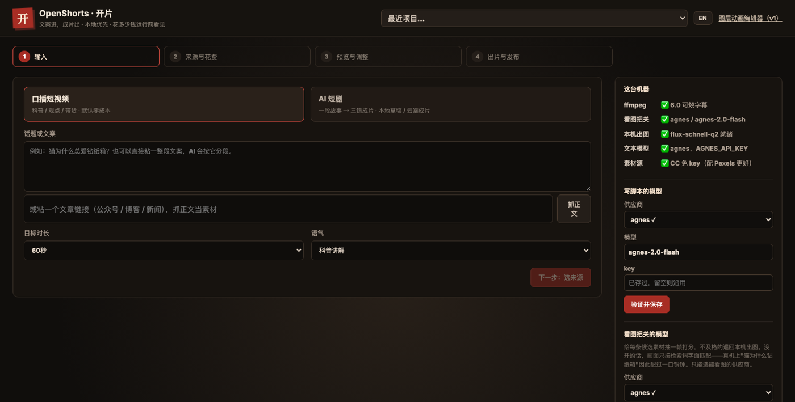
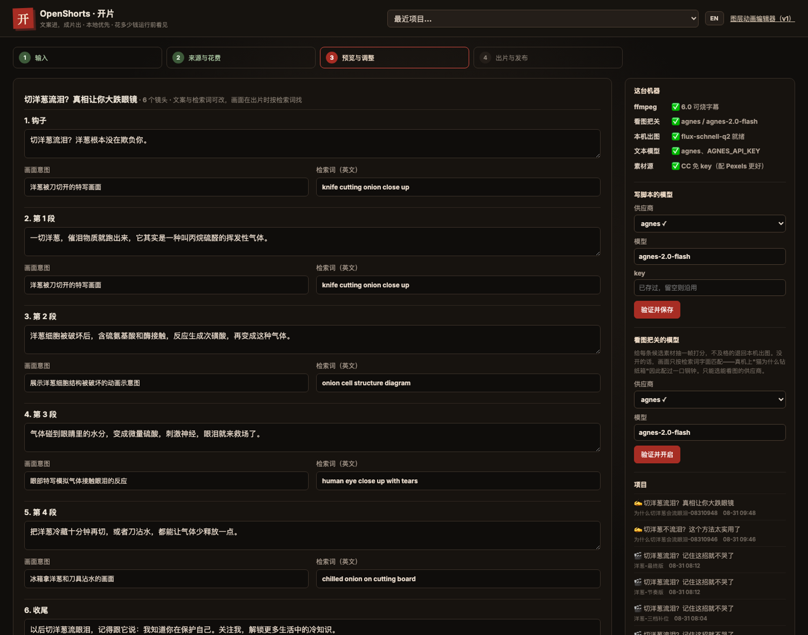
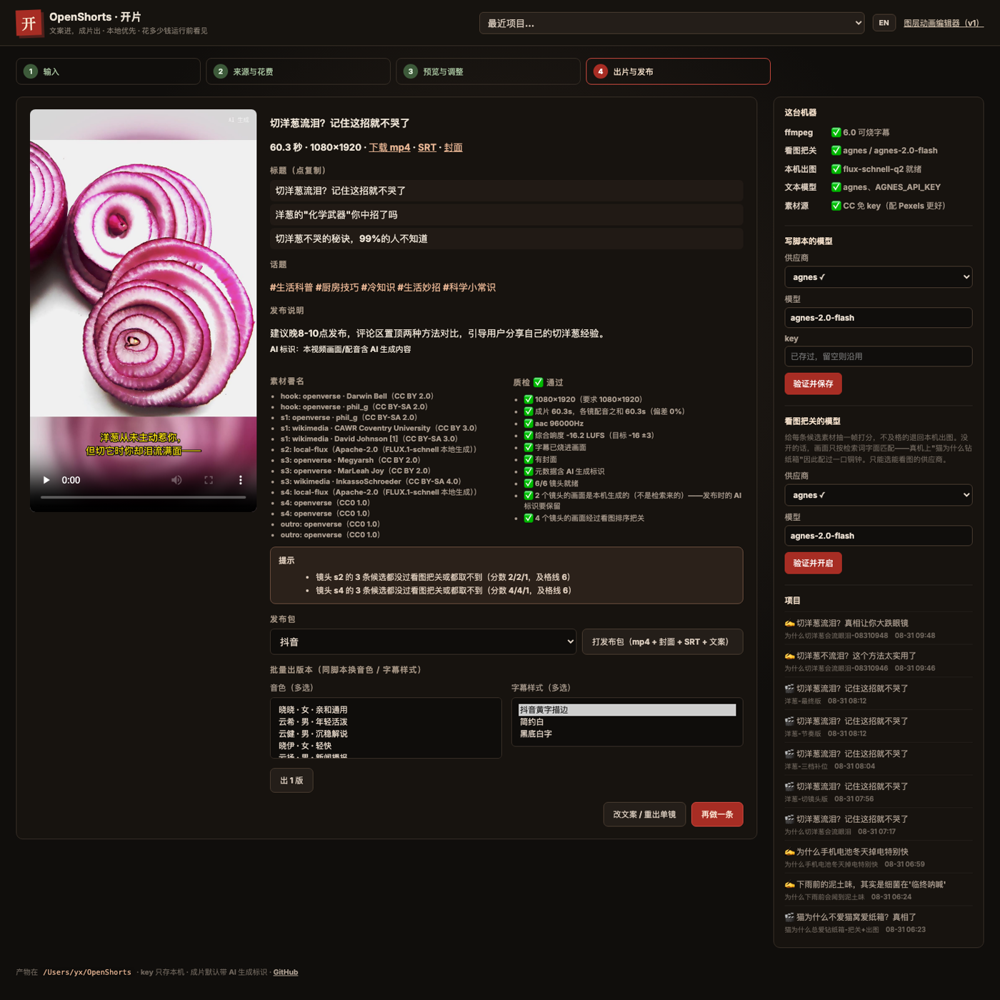
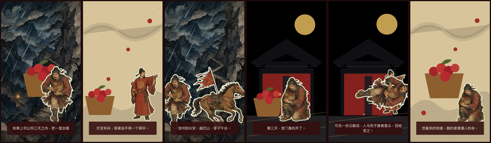
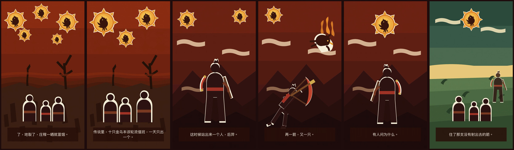

# OpenShorts · 开片

**文案进，成片出。** 一条本地优先的开源短视频生产线：给一个话题，它写脚本、找画面、配音、烧字幕、出成片和发布文案——
**默认零成本跑通第一条**，花多少钱、等多久，运行前就告诉你。

<p align="center"></p>
<p align="center"><sub>上面这条 60 秒的片子：0 元、0 个付费 key，6 镜里 2 镜是素材库没货时本机现画的 · <a href="docs/cases/koubo-onion/">看完整案例</a></sub></p>

    

```bash
npx openshorts          # 起本地服务并打开浏览器（http://127.0.0.1:4174）
```

需要 Node.js 20+ 和 FFmpeg。**装完先跑一次 `openshorts doctor`**——它会告诉你这台机器现在能不能出片，以及缺什么。

---

## 长什么样

四步走完一条片：**输入 → 来源与花费 → 预览与调整 → 出片与发布**。右侧常驻栏回答"我这台机器现在能干什么"，
模型也在那里配（写脚本的模型、看图把关的模型，存之前会拿它真发一次请求验一下）。

### ① 输入



给个话题，或直接粘一整段文案，也可以贴一个文章链接让它抓正文。目标时长和语气可选。

### ③ 预览与调整——**每一镜都能改**



AI 拆出的每一镜都摊开给你：**口播文案**、**画面意图**、**英文检索词**，全都可以直接改。
改完只重出那一镜——配音按"文案 + 音色 + 语速"的指纹复用，画面按素材指纹复用，没动过的镜头一秒都不重跑。

### ④ 出片与发布



成片、SRT、封面一次给全；标题点一下就复制；**每一条素材的作者与许可证都列出来**（CC BY-SA 要求的署名一条不少）；
自动质检逐项报事实（分辨率 / 时长偏差 / 响度 / 字幕有没有烧进画面 / AI 标识 / 有几镜是本机生成的）；
最后按平台规格打发布包——**不自动发布**，拖进后台由你决定。

## 为什么选开片（和 MoneyPrinterTurbo 们的区别）

| 你关心的 | 开片 | 素材拼片类工具（如 MoneyPrinterTurbo） | 平台一键 AI 工具 |
|---|---|---|---|
| **第一条片要花多少钱、要配什么** | **0 元、0 个 key**：CC 图片（完整图 + 虚化垫底 + 缓推）与视频 + Edge TTS + 本机 ffmpeg；注册免费 Pexels key 后换成实拍视频，画面更好 | 要先注册素材库 key | 会员 / 积分 |
| **素材库没货怎么办** | **本机现画一张**（FLUX.1-schnell，Apache-2.0 可商用，不花钱不联网）——洋葱、抽象概念这类题材素材库里本来就没有 | 只能凑合用不相干的 | 平台自家模型 |
| **画面从哪来** | 素材库 · 本机出图 · 本地出片（sd.cpp）· 云端 AI（秘塔 / 火山 / Agnes …）· 图层动画，**同一条片可混用** | 只有素材库（近期加了一家云端） | 只有平台自家模型 |
| **谁来把关** | 看图验收员：每条候选素材抽一帧按"画面意图"打 0–10 分，**≥6 才能当主画面，4–5 只能补切段，<4 判退**，不及格就回落到本机出图。没配看图模型时，质检会明说"这些画面没人看过" | 无 | 人工 |
| **画面多久换一次** | 一镜切多段，**平均 4–6 秒一换**（不切时是 10 秒），切到的每一段都过了相关性门槛 | 随机拼接，不做相关性检查 | 黑盒 |
| **花钱之前知道要花多少** | 运行前按所选供应商 / 档位 / 秒数给数量级；口播线钱恒为 0，`estimate` 报的是**要等多久** | 无 | 事后看余额 |
| **改一镜要不要全重来** | 单镜重出：口播改一句话只重出那一镜；短剧按验收意见 / 提意见 / 换来源 | 全部重跑 | 重新生成 |
| **脚本谁写** | 276 位专家角色分工（科普作者写稿、抖音策略师起标题、编剧拆三镜） | 一个通用 prompt | 黑盒 |
| **数据在哪** | 本地优先：key 只存本机，产物在你硬盘，素材署名与 AI 标识写进发布文案 | 本地 | 云端 |
| **怎么装** | `npx openshorts` 一行 / Docker | Python 环境 / 整合包 | App |

一句话：**别人给你一个出片按钮，开片给你一条能看见成本、能被审、能改单镜的生产线。**

## 成片示例

**v2 · 开片**（由四步界面或 `openshorts` 命令行生成）

| 成片 | 路线 | 时长 | 案例 |
| --- | --- | --- | --- |
| 《为什么切洋葱会流眼泪》 | 口播科普 · CC 素材 + **本机 FLUX 出图** · 看图把关 · 一镜切多段 · **0 元 0 key** | 60s | [docs/cases/koubo-onion](docs/cases/koubo-onion/) |
| 《猫为什么总爱钻纸箱》 | 口播科普 · 免 key 素材 · Edge TTS（**早期版本**，字幕与画面都不如上面那条，留作对照） | 37s | [docs/cases/koubo-cat-box](docs/cases/koubo-cat-box/) |
| 《深夜便利店》本地草稿档 | AI 短剧 · 本地 sd.cpp · MiniMax-H3 Q2 · **0 元** | 7s | [docs/cases/drama-convenience-store](docs/cases/drama-convenience-store/) |
| 《深夜便利店》云端成片档 | AI 短剧 · Agnes agnes-video-2.5-flash | 13s | 同上（同一故事的草稿 vs 成片对照） |

**v1 · 图层动画**（纸片剪纸风格，`npm run story -- <名字> render` 渲出，见文末）

| 成片 | 路线 | 时长 | 内容源 |
| --- | --- | --- | --- |
| 《后羿射日》 | 故事片 · 纸片动画 | 62s | [content/nine-suns](content/nine-suns) |
| 《三天荔枝道》 | 故事片 · 纸片动画 | 55s | [content/lychee-road](content/lychee-road) |
| 《这条视频是它自己生成的》 | 产品演示 · 自举 | 48s | [content/openshorts-demo](content/openshorts-demo) |

示例均由 OpenShorts 实际生成；案例页里连"哪一镜不够好、为什么"都如实标着。

> v2 方向与设计文档见 [`docs/v2/`](docs/v2/00-README.md)（需求 / 架构 / 开发计划 / 决策记录 / 同类项目拆解）。
> 编排与出片引擎复用 [agency-orchestrator](https://github.com/jnMetaCode/agency-orchestrator)。

## 快速开始（v2 · 开片）

需要 Node.js 20+ 和 FFmpeg。一行起本地服务并打开浏览器（默认 http://127.0.0.1:4174）：

```bash
npx openshorts
```

> **装完先跑一次 `openshorts doctor`。** 短视频的字幕必须**烧进画面**（抖音、视频号一律不认软字幕轨），
> 而烧字幕要 ffmpeg 带 libass。**Homebrew 现在的 `ffmpeg` formula 已经不再依赖 libass**
> （`brew deps ffmpeg` 里没有它），所以 `brew install ffmpeg` 装出来的那份烧不了字——重装也没用。
> doctor 查到就照它说的跑一次 `openshorts install-ffmpeg`：装一份带 libass 的到 `~/.openshorts/bin`
> （约 40 MB，只对开片生效，不动系统 ffmpeg）。界面第 2 步也有同一个按钮。

命令行同一套能力：

```bash
openshorts doctor                                   # 体检：ffmpeg / libass / 中文字体 / ulimit / 各画面来源
openshorts install-ffmpeg                           # doctor 说缺 libass 时跑这个（字幕才能烧进画面）
openshorts new koubo-kepu --topic "猫为什么总爱钻纸箱" --voice zh-CN-YunxiNeural --local-dir ./素材
openshorts run ~/OpenShorts/猫为什么总爱钻纸箱/project.json   # 0 元：Edge TTS + 素材库/本地素材 + 本机 ffmpeg
openshorts run ~/OpenShorts/猫为什么总爱钻纸箱/project.json --only s2   # 只重出第 2 镜（换素材），其余复用
openshorts install-image                             # 本机文生图模型（FLUX.1-schnell，Apache-2.0）：素材库没命中时现画一张
openshorts estimate ~/OpenShorts/<项目>/project.json  # 要花多少钱、大概等多久
openshorts export  ~/OpenShorts/<项目>/project.json --platform douyin   # 发布包（mp4+封面+SRT+文案），不自动发布
openshorts batch   ~/OpenShorts/<项目>/project.json --captions douyin,clean   # 同脚本出多版
openshorts drama --plan -i story="…" -i video_provider=local-sdcpp -i video_model=minimax-h3-q2   # AI 短剧：先看花费
```

- 写脚本用你自己的文本模型 key（复用 [AO](https://github.com/jnMetaCode/agency-orchestrator) 的 `~/.ao` 配置或环境变量如 `DEEPSEEK_API_KEY`）；画面**不配 key 也能出**（Wikimedia Commons 的 CC 图片为主、视频为辅；图片检索比视频准得多，静图会加虚化垫底与缓推），配一把免费的 Pexels / Pixabay key 换成实拍视频会更好（界面一分钟引导）；配音默认 Edge TTS（免费）。产品不内置任何共享 key。
- **本机出图**（口播线）：`openshorts install-image` 装 FLUX.1-schnell（6.4 / 10 GB 两档，Apache-2.0 可商用）。装了之后，素材库没命中的镜头会本机现画一张（M2 Max 实测约 57 秒），而不是退纯色底。
- **本地出片**（短剧线）：`openshorts doctor` 会告诉你这台机器能跑哪一档（24 GB 内存起，草稿画质），以及 sd-cli 与模型怎么装。
- 产物落在 `~/OpenShorts/<项目>/`；成片默认带 AI 生成标识；素材署名写进发布文案。

v1 的图层动画编辑器仍在 `/editor`，用法见下文。

---

# v1 · 图层动画编辑器

> 下面是 v1 的纸片剪纸 / 信息板路线，作为「图层动画」这一种画面来源保留。
> 只想用开片出短视频的话，读到这里就够了。

## v1 为什么这样做

原方法论的真正价值不是某一条唐朝视频，而是四个可以产品化的约束：

1. **先镜头，后素材**：每个镜头有独立时长、构图与素材清单。
2. **叙事权重驱动运动**：`primary / secondary / tertiary` 不只是标签，它决定入场距离、缩放和漂浮幅度。
3. **图层协议优先**：编辑器、播放器、CLI 和渲染器读取同一份 JSON，避免“预览和成片不是一个逻辑”。
4. **人工验收是流水线节点**：生成模型、抠图和 TTS 可以替换，静态排版与成片检查不能省略。

## 快速开始（v1 · 图层动画）

需要 Node.js 20+、FFmpeg 和 ImageMagick。FFmpeg 用于媒体验收，ImageMagick 用于抠图、拆分和透明通道检查。

macOS 可以直接双击项目根目录的 `启动本地.command`。也可以在终端运行，命令会自动启动服务并打开浏览器：

```bash
npm run open
```

窗口必须保持运行；关闭终端或按 `Ctrl+C` 会停止本地服务。若 `4174` 被占用，可执行 `PORT=4175 npm run open`。

如需启用 LLM 分镜，可连接任意支持 Chat Completions JSON 输出的兼容服务：

```bash
export OPENSHORTS_PLANNER_URL="http://127.0.0.1:1234/v1/chat/completions"
export OPENSHORTS_PLANNER_MODEL="your-model"
# 仅远端服务需要鉴权时设置：OPENSHORTS_PLANNER_API_KEY
```

批量审核并记录生成来源：

```bash
npm run review -- --project=projects/my-video.json --assets=all \
  --status=approved --provider=comfyui --model=flux --seed=42
```

本地 ASR 程序需要接收最后一个参数中的音频路径，并向 stdout 输出 `{"language":"zh","segments":[{"text":"...","start":0,"end":1.2,"words":[]}]}`：

```bash
export OPENSHORTS_ASR_COMMAND="/absolute/path/to/asr-adapter"
export OPENSHORTS_ASR_ARGS_JSON='["--model","large-v3","--json"]'
npm run dev
```

也可以导入已有 Whisper/FunASR JSON：

```bash
npm run captions -- --project=projects/my-video.json \
  --transcript=examples/transcript.json --scene=scene-01
```

容器启动：

```bash
docker compose up --build
# http://localhost:4174
```

完整部署说明见 [docs/deployment.md](docs/deployment.md)。发布前可运行：

```bash
npm run release:check
npm run release:bundle
```

```bash
# macOS。注意 brew 的 ffmpeg 不含 libass，装完再跑一次 `openshorts install-ffmpeg` 才能烧字幕
brew install ffmpeg imagemagick
```

```bash
npm install
npm run dev
```

打开 `http://127.0.0.1:4173`。左侧管理镜头，中间可在“动画预览”和“拖拽排版”间切换，右侧可修改人物位置、宽度、层级、角色类型、入场方向与延迟，也可上传透明 PNG / WebP / SVG 替换图层。

编辑器支持：

- `⌘/Ctrl + Z` 撤销，`⇧ + ⌘/Ctrl + Z` 重做，最多保留 40 步。
- 复制或删除镜头；新镜头从当前镜头复制，便于保持统一视觉模板。
- 复制、删除、上移或下移图层。
- 导入 OpenShorts v1 JSON；导入后先在浏览器检查，再点击保存。
- 拖拽非背景图层，并显示字幕安全区。
- 上传 WAV、MP3、M4A、AAC、FLAC 或 OGG 旁白，通过 ffprobe 自动匹配镜头帧数。
- 可视化调整每句字幕的入场帧和出场帧。
- 渲染完成后从网页生成验收报告和逐镜头抽帧。
- 检查素材尺寸、透明通道和内容贴边风险。
- 选择任意纯色背景和容差进行本地抠图。
- 按行列拆分角色素材表，并点击缩略图替换当前图层。
- 管理多个本地项目，并从模板创建互相独立的新工程。
- 使用 `{{变量名}}` 批量替换标题、字幕及其他字符串字段。
- 渲染任务持久化到磁盘，失败或进程中断后可以重试。
- 将项目 JSON 和全部本地素材导出为可迁移 `.openshorts.zip`。
- 安全导入项目包，拦截路径穿越、符号链接和超大解压内容。
- 取消等待中或运行中的渲染/ComfyUI 任务。
- 从中文文案自动规划全景、中景和特写镜头。
- 生成背景、主体、配角和前景的独立素材提示词与验收要求。
- 将角色年龄、发型、服饰和配色锚点注入跨镜头提示词。
- 一键组装横屏或竖屏可编辑草稿。

生产模式：

```bash
npm run build
npm start
```

打开 `http://127.0.0.1:4174`。

## 渲染与校验

```bash
# 校验项目协议与图层布局数据
npm run validate

# 渲染 projects/sample.json 到 out/tang-paper-demo.mp4
npm run render

# 渲染另一份项目文件
npm run render -- projects/my-story.json

# 检查成片规格、字幕、素材和图层，并抽取每个镜头的中间帧
npm run quality

# 检查指定成片和工程
npm run quality -- out/my-story.mp4 projects/my-story.json

# 打开原生 Remotion Studio
npm run studio
```

## 完整案例：《三天荔枝道》



仓库内置一个 55 秒、1080×1920 的六镜头故事工程：`projects/lychee-road.json`。它包含独立背景与人物图层、完整口播文案、烧录字幕、原创配乐，以及雨声、马蹄、冲击和转场音效。

```bash
# 正式渲染：Remotion 出画面（入场动画、关键帧、纸片描边），再统一做音频母带
npm run story -- lychee-road render

# 没有 Chrome 时的降级预览：纯 FFmpeg，只有推镜，没有入场动画
npm run story -- lychee-road render --fallback

# macOS 普通终端：生成有效中文旁白并按实际时长重建工程
npm run story -- lychee-road audio

# 已安装 Kokoro 时完全离线生成中文旁白
npm run story -- lychee-road audio:local
```

### 两条渲染路径的关系

| | `render.mjs`（Remotion） | `render-story-ffmpeg.mjs`（降级） |
| --- | --- | --- |
| 依赖 | Chrome / Chromium | 仅 FFmpeg + ImageMagick |
| 入场动画、关键帧、漂浮 | ✅ | ❌ 只有推镜 |
| 纸片描边与落影 | ✅ | ❌ |
| 逐字字幕高亮 | ✅ | ❌ |
| 图层坐标与旋转锚点 | 基准 | 与基准一致（`scripts/lib/layout.mjs` 换算） |
| 字幕排版与安全区 | 共用 `shared/captions.mjs` | 共用 `shared/captions.mjs` |
| 音轨 | 共用 `scripts/lib/audio-master.mjs` | 共用 `scripts/lib/audio-master.mjs` |

正式发布用 Remotion。降级路径只保证坐标、字幕和声音一致，不保证运动——它的定位是「没有 Chrome 时先看清排版」。

音轨由 `npm run master -- <成片> <工程>` 独立完成，两条路径渲完都走这一步。

`story ... audio` 用逐镜 `edge-tts` 生成旁白，音色见下方「旁白音色」一节，并按“音色 + 参数 + 文案”缓存。它会验证每段语音的文件大小和真实时长，空音频立即中止，不会生成“有音轨但没有人声”的假成片。`edge-tts` 客户端虽然开源免费，但调用的是微软在线语音服务，并非离线模型；完全离线部署可直接使用已接入的中文专用 Kokoro-82M-v1.1-zh（Apache-2.0，见 `docs/tts.md`）。研究来源、史实边界和发布文案位于 `content/lychee-road/`。

## 第二个案例：《后羿射日》——用数据做一条新视频



两个故事现在都是**纯数据驱动**，做一条新视频只需要三样东西，不用改一行渲染代码，也不用往 `package.json` 里加脚本：

- `content/<故事名>/story.json` —— 逐段口播文案；
- `content/<故事名>/storyboard.json` —— 分镜编排（每镜的图层、位置、入场、音效点位、镜头推进）；
- `public/assets/generated/<故事名>/` —— 分层素材（SVG 或透明 PNG 均可）。

放好这三样，`npm run story -- <故事名>` 就能出片。关键帧的 `frame` 可以写 `"end"`，表示本镜最后一帧，旁白时长变化时运动终点自动跟上。

```bash
# 生成旁白并构建工程
npm run story -- nine-suns audio

# 渲染 + 媒体验收
npm run story -- nine-suns render

# 一键发布：渲染、验收、原子更新成片、Whisper 反识别、SHA-256 清单
npm run story -- nine-suns release
```

### 从一个话题开始（可选，需 LLM 服务）

连上任意 OpenAI 兼容服务后，一个话题直接起稿：

```bash
export OPENSHORTS_PLANNER_URL="http://127.0.0.1:1234/v1/chat/completions"
npm run new -- sky-blue --topic="为什么天空是蓝的" --format=9:16
```

产出 `content/sky-blue/{story,storyboard,assets}.json` **可审阅草稿**（信息板骨架，文案已按爆款分镜规则拆段），人工校对事实后走常规流水线。这里与一键出片工具的分野是刻意的：草稿必须过人眼，成片必须过门禁。

画幅由 `story.json` 的 `format` 决定（`9:16` / `16:9`），字幕安全区与字号自动适配。

统一入口 `npm run story -- <故事名> [阶段]` 支持 `audio`、`audio:local`、`build`、`render`、`release` 五个阶段，加 `--fallback` 走无 Chrome 的降级渲染。不带参数会列出 `content/` 下所有可用的故事。

音效（雨声、马蹄、冲击、转场）放在 `public/audio/common/` 共享，各故事目录保留自己的旁白和配乐。

## 旁白音色

写在 `content/<故事名>/storyboard.json`：

```json
"voice": {"name": "zh-CN-YunyangNeural", "rate": "+0%", "pitch": "+0Hz"}
```

试听候选音色并对比：

```bash
node scripts/preview-voices.mjs                                  # 同一句话，6 个音色各念一遍
npm run story -- nine-suns audio --voice=zh-CN-YunxiNeural       # 临时覆盖，不改配置
```

语速为负时必须用等号形式（`--rate=-6%`），否则负号会被当成命令行标志。换音色会改变旁白时长，工程时间轴、字幕分配和配乐长度都会自动重算。

## 配乐

默认按故事情绪合成，写在 `storyboard.json`：

```json
"music": {"mood": "epic"}
```

可选 `epic`（宫调，开阔）、`urgent`（羽调，紧迫）、`elegiac`（低八度，苍凉）、`bright`（徵调，明快）、`pulse`（电子脉冲，科技解说向）。合成用 Karplus-Strong 弹拨弦加 Schroeder 混响，音高序列由故事名派生的 seed 决定——同一个故事永远得到同一首曲子，不同故事天然不同。

### 接入自备配乐

合成器的定位是兜底。有现成音乐时直接导入：

```bash
node scripts/import-music.mjs nine-suns ~/Downloads/track.mp3 \
  --start=8 --credit="作者 - 曲名" --license="CC BY 4.0"
```

导入会做三件事：跳过指定的前奏、**把响度归一到 -20 LUFS**、写入 `storyboard.json`。

归一这步不能省：外来音乐的响度从 -8 到 -25 LUFS 都常见，而旁白闪避的 sidechain 按幅度判定——太响会让压缩器全程压着，太轻则根本触发不了。归一后 `soundtrackVolume` 才是个有确定含义的数字。

第三方音乐大多要求署名。`--credit` 会随工程流进验收报告；没填时 `npm run quality` 会告警。导入的文件放在 `public/audio/custom/`，已在 `.gitignore` 中——授权因来源而异，不适合进仓库。

## 旁白反向验收

`npm run story -- <故事名> release` 会用本地 Whisper 转写成片，做两层检查：

1. **语言与可转写性**（Python 侧）—— 抓「有音轨但没人声」的假成片。
2. **内容覆盖**（`scripts/lib/asr-coverage.mjs`）—— 逐段比对转写与文案，抓漏段、错序和「混进了别的故事的旁白」。

第二层是必要的：第一层只回答「成片里有没有中文人声」，漏掉一整段照样通过。

比对必须容忍同音错字——本地小模型把「金乌」听成「金屋」、「一箭」听成「一剑」是常态，不代表 TTS 读错了。所以按滑窗 Dice 相似度判定，阈值 0.55 由真实数据标定：

| 场景 | 每段最低相似度 |
| --- | --- |
| 正常（含同音错字） | 0.732 |
| 漏掉其中一段 | 0.197 |
| 整条换成别的故事 | 0.113 |

不能对整篇算 LCS——中文字符复用率高，漏掉一整段后仍能从别处凑出 0.84 的覆盖率，判别力归零。必须要求文案以连续的一段出现。

## 素材溯源

来源不明的素材不能商用，而元数据很容易在处理环节丢失——本仓库《三天荔枝道》的 5 张 PNG 就是这么丢的：抠图时 ImageMagick 清掉了原始元数据，git 提交和文档都没记，现在已无从查证。

所以溯源存在源头 `content/<故事名>/assets.json`，构建时才写进工程。**不要直接改 `projects/*.json` 里的 `assetPlan`——那是生成物，下次构建就没了。**

### ComfyUI：生成即记录

接了 ComfyUI 的话，生成和记录是同一条命令，不用手抄 model/seed：

```bash
COMFYUI_URL=http://127.0.0.1:8188 npm run comfy -- nine-suns \
  --workflow=wf.json --name=hou-yi --layer --license=CC0
```

它会提交工作流、下载图片、放进 `public/assets/generated/<故事名>/`、检查透明通道和贴边，
并把 model、seed、正负提示词、采样参数、尺寸和 prompt_id 自动写进 `assets.json`。

工作流必须是 ComfyUI 的 **Save (API Format)** 导出——界面 workflow 的结构不同，解析不出参数。
解析不到模型或种子时会警告，因为那样的图无法复现。

### 手工记录

其他来源（手写 SVG、图库、自行拍摄、别的生成工具）生成完立刻记录：

```bash
npm run asset -- nine-suns assets/generated/nine-suns/layers/hou-yi.png \
  --provider=comfyui --model=flux.1-dev --seed=42 \
  --prompt="剪纸风格弓箭手，纯绿背景" --license=CC0
```

来源类型：`handwritten-svg`（手写 SVG，本仓库原创）、`comfyui`、`imagegen-agent`、`stock`、`photograph`、`unknown`。除 `unknown` 外都视为可商用；`comfyui` 和 `imagegen-agent` 必须同时提供 `--model`。

`npm run quality` 会报告来源未知的素材。公开发布前把它升级为硬错误：

```bash
QUALITY_REQUIRE_PROVENANCE=1 npm run quality -- out/my-story.mp4 projects/my-story.json
```

当前状态：《后羿射日》8 个素材全部为手写 SVG，来源可查；《三天荔枝道》8 个中有 5 张 PNG 标注为来源未知，公开发布前需重新生成。

## 素材处理 CLI

网页中的素材工具也可以独立运行：

```bash
# 检查尺寸、通道、内容边界和裁切风险
npm run assets -- inspect public/assets/character.png

# 移除绿色背景；默认自动裁边并增加 12px 安全留白
npm run assets -- key source.png output.png '#00ff00' 12

# 保留原始画布，适合抠图后继续按网格拆分
npm run assets -- key sheet.png sheet-alpha.png '#00ff00' 12 preserve

# 将一行六列素材表拆成独立 PNG
npm run assets -- split sheet-alpha.png public/uploads/six 1 6 character
```

抠图使用颜色相似度而非生成模型，适合纯绿、纯蓝、纯白等干净背景。头发、半透明薄纱或复杂反光素材建议在专业抠图模型中处理后再导入。

## 生成适配器

`adapters/*/adapter.json` 定义开放适配器协议，`GET /api/adapters` 会返回能力与配置状态：

- **手动上传**：默认可用，可接任意绘图服务。
- **Imagegen Agent**：由拥有图像生成工具的 Agent 生成素材并写入 `public/uploads/`，核心项目不持有密钥。
- **ComfyUI**：设置运行时 `COMFYUI_URL` 后被标记为已配置，适合本地工作流。

协议类型见 [`src/adapters/types.ts`](src/adapters/types.ts)，扩展说明见 [`adapters/README.md`](adapters/README.md)。

## 多项目与模板

项目保存在 `projects/*.json`，模板保存在 `templates/*.json`。模板既可以内嵌一个完整 `project`，也可以通过 `sourceProjectId` 复制现有工程。

工作台左上角可以切换项目或从模板创建项目。切换前会先保存当前工程，新项目会自动生成安全且不重复的 ID。

## 批量变量渲染

先在标题或字幕中放入变量：

```text
欢迎来到 {{城市}}
```

再在工作台批量变量区提交：

```json
[
  {"name": "长安版", "variables": {"城市": "长安"}},
  {"name": "洛阳版", "variables": {"城市": "洛阳"}}
]
```

每个版本会成为独立渲染任务。变量递归应用于项目中的字符串字段，但不会改写原始工程。

## 持久化任务队列

任务状态保存在忽略提交的 `data/jobs.json`：

- `queued`：等待渲染
- `running`：正在渲染
- `done`：完成并提供 MP4
- `failed`：失败，可以重试
- `interrupted`：进程退出时仍在执行，可以重试
- `cancel_requested / cancelled`：正在请求取消或已经取消

任务采用本机串行渲染，降低 Chrome 和 FFmpeg 并发导致的内存峰值。API 包括 `GET /api/jobs`、`POST /api/jobs/:id/retry` 和 `POST /api/render/batch`。

单个视频的帧渲染并发默认为 1，可根据机器内存调整：

```bash
OPENSHORTS_RENDER_CONCURRENCY=2 npm start
```

## 项目包导入导出

网页顶部可以直接“打包项目”或“导入项目包”。CLI 用法：

```bash
npm run bundle -- export projects/sample.json out/my-project.openshorts.zip
npm run bundle -- import out/my-project.openshorts.zip projects/imported.json
```

项目包包含 `project.json`、`manifest.json` 和 `public/` 下被引用的本地素材。导入时素材会迁移到独立命名空间并重写项目路径，避免覆盖已有素材。

## ComfyUI 实际执行

```bash
COMFYUI_URL=http://127.0.0.1:8188 npm run dev
```

在左侧素材适配器中选择 ComfyUI API workflow JSON。工作台会提交 `/prompt`、轮询 `/history/:promptId`、下载 `/view` 图片、检查透明通道与边缘，然后自动放入素材结果区。任务可取消、失败可重试。

## 文案成片策划台

点击顶部“文案成片”，输入口播文案和角色设定。确定性规划器会：

1. 按中文标点切句，并将过短句子合并为镜头。
2. 按约每秒 4.2 个有效汉字估算旁白帧数。
3. 循环安排全景、中景和特写，明确每个镜头的叙事目的。
4. 按句子长度分配字幕时间区间。
5. 为背景、主体、配角素材表和前景装饰生成独立提示词。
6. 将角色设定作为一致性锚点注入人物提示词。
7. 使用项目内占位素材组装可以立即预览和渲染的草稿。

无需启动网页也可以生成：

```bash
npm run draft -- \
  --id=my-story \
  --title=长安的一天 \
  --text=长安城从晨雾中醒来。万国使者走进宫门。 \
  --aspect=16:9 \
  --style=tang-collage \
  --characters=主角：深青色圆领袍，黑色幞头，二十五岁
```

输出包括 `projects/my-story.json` 和 `out/briefs/my-story-asset-brief.md`。内置风格包括唐风古籍拼贴、水墨纸片和现代商业纸片。

也可以在网页中先“保存项目”，再点击“渲染 MP4”。任务在本地异步执行，页面会显示进度和成片链接。

## 项目协议

工程保存在 `projects/*.json`。最小结构如下：

```json
{
  "schemaVersion": 1,
  "id": "my-story",
  "title": "我的纸片故事",
  "width": 1920,
  "height": 1080,
  "fps": 30,
  "theme": {
    "paper": "#f5eedc",
    "ink": "#201712",
    "accent": "#a72d24",
    "subtitleBackground": "rgba(31,20,15,.84)"
  },
  "scenes": []
}
```

图层的重要字段：

| 字段 | 含义 |
| --- | --- |
| `role` | `background / tertiary / secondary / primary / foreground`，决定运动力度 |
| `x, y, width` | 画布中的静态排版；动画应在静态排版确认后添加 |
| `zIndex` | 前后遮挡关系 |
| `delayFrames` | 错峰入场时间 |
| `entrance` | `none / left / right / up / down / scale / fade` |
| `paperEdge` | 统一白色剪纸描边和落影 |
| `kind` | `image / text / video`，默认 `image` |
| `style` | 仅 `text`：字号、字重、对齐、等宽、卡片底色、逐行显现（`revealFrames`） |
| `startFrom` | 仅 `video`：从源视频第几秒起播；视频图层强制静音，声音统一走音频母带 |

三种图层对应两条内容产线：故事片用 `image`（分层纸片动画），技术讲解用 `text`（信息板/PPT/代码终端是同一原语的不同排版）加 `video`（引用真实画面佐证论点）。文字与视频图层示例：

```json
{"id": "hero", "kind": "text", "role": "primary", "x": 96, "y": 450, "width": 920, "zIndex": 6,
 "style": {"text": "$10", "fontSize": 230, "fontWeight": 900, "color": "#e8a33d", "align": "center"}}
```

```json
{"id": "demo", "kind": "video", "src": "assets/quoted/my-story/clip.mp4", "startFrom": 1.2,
 "role": "secondary", "x": 96, "y": 1140, "width": 720, "zIndex": 4}
```

降级渲染（无 Chrome）下文字由 ImageMagick 排版、视频取海报帧当静态图，位置与 Remotion 一致。

完整示例见 [`projects/sample.json`](projects/sample.json)。

协议由 Zod 在 [`shared/project-schema.mjs`](shared/project-schema.mjs) 中定义，这是唯一的一份：浏览器编辑器、Remotion 渲染器、Express 服务端和 `npm run validate` 全部从这里读同一个 schema，`src/domain/project.ts` 只负责导出推导出来的 TypeScript 类型。

写入路径（`PUT /api/project`、模板创建、项目包导入）都会完整校验并补齐默认值；不合法的工程返回 400 并指出具体字段，不会存进磁盘：

```json
{
  "error": "项目不符合 OpenShorts v1 协议：\n- scenes.0.layers.0.src：Invalid input: expected string, received undefined",
  "issues": ["scenes.0.layers.0.src：Invalid input: expected string, received undefined"]
}
```

时间轴越界（关键帧或字幕超出镜头时长）不在写入时拦截——编辑器里缩短镜头是常规操作——而是由 `npm run quality` 在验收阶段报告。

## 推荐素材规范

- 背景底板：无主要人物，画布原始尺寸，PNG / WebP / SVG。
- 独立角色：透明背景、完整身体、无裁头裁脚；长边建议至少 1200px。
- 素材表拆分：每个角色输出为独立透明 PNG，四周保留 2%～5% 空白。
- 角色朝向：生成阶段明确左/右朝向；必要时使用 `flipX`，但文字和非对称服饰不建议镜像。
- 音频：旁白按镜头切分；项目协议已保留 `narrationSrc` 和 `soundtrackSrc`。

## 竖屏发布规范

竖屏工程（`height > width`）的字幕与响度由渲染器统一处理，两条渲染路径共用 `shared/captions.mjs` 的同一套规则：

- 字幕位于底部 20% 之上，避开抖音、快手、视频号的账号名、话题和进度条。
- 单行上限 16 个汉字；断句只发生在标点处，不会把词拆开。
- 字号按画面短边的 4.5% 计算，横屏与竖屏每行字数一致。
- 成片响度对齐平台归一化目标 -14 LUFS，真峰值不超过 -1.5 dBFS。
- 配乐按旁白自动闪避约 10 dB，并在短于成片时循环补齐。

`npm run quality` 会校验以上各项；FFmpeg 渲染器自动探测中文字体，也可用 `OPENSHORTS_SUBTITLE_FONT` 指定。

## 架构

```text
projects/*.json ───┬──> Studio 可视化编辑器
                  ├──> Remotion Player 实时预览
public/assets/ ───┼──> Remotion Renderer 输出 MP4
public/uploads/ ──┘
```

- `src/domain/`：项目协议与纯数据逻辑
- `src/motion/`：角色权重和入场运动系统
- `src/remotion/`：逐帧视频组件
- `src/studio/`：浏览器编辑器
- `server/`：工程保存、素材上传和本地渲染 API
- `scripts/`：无界面校验与渲染命令

## 能力边界

核心没有把 Imagegen、F5-TTS 或任何云服务写死。生成图、抠图、TTS 都应该是可插拔的“素材供应器”，而 JSON 协议、编排、预览和渲染才是稳定内核。这样用户可以选 OpenAI、ComfyUI、本地模型、真人录音或其他 TTS。

Remotion 本身使用独立许可条款。个人和小团队、自动化产品等场景的许可可能不同；公开部署或商业化前请阅读 [Remotion 官方许可说明](https://www.remotion.dev/)。OpenShorts 自有代码采用 MIT License，不会改变第三方依赖的许可。

## 路线图

- v0.2：镜头增删复制、画布拖拽、图层排序、撤销/重做、项目导入（已完成）
- v0.3：字幕时间轴、旁白时长自动切镜、FFmpeg 自动抽帧验收报告（已完成）
- v0.4：抠图、素材表拆分、素材质检、Imagegen 与 ComfyUI 适配器协议（已完成）
- v0.5：多项目、模板库、批量变量、持久化任务队列和可恢复渲染（已完成）
- v0.6：ComfyUI 工作流执行、任务取消、渲染并发策略和项目打包导入导出（已完成）
- v0.7：镜头脚本生成器、素材需求单、角色一致性提示词和自动组装草稿（已完成）
- v0.8：LLM 规划适配器、提示词版本管理、素材与需求单自动匹配

## 开源贡献

提交前运行：

```bash
npm test
npm run validate
npm run build
```

欢迎贡献新的风格模板、动画预设、素材供应器和验收规则。不要提交受版权限制的素材、声音克隆样本或密钥。
