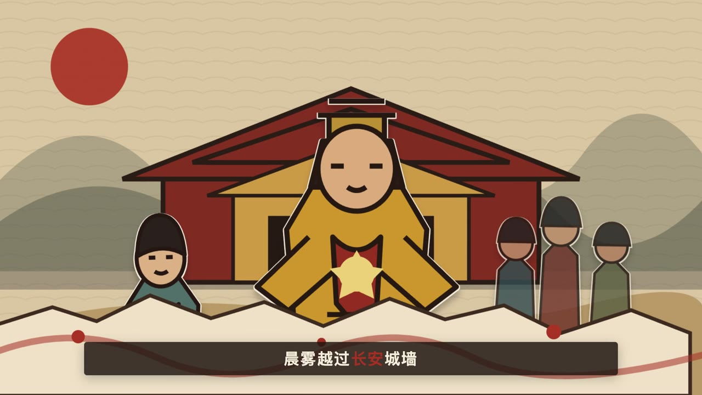

# PaperCut Studio



<p align="center"></p>

一个本地优先、可视化、可扩展的分层纸片动画生产工具。它把“背景、后排、主体、前景分别运动”的方法固化为开放的 JSON 项目协议，并使用 Remotion 预览和渲染。

> 当前为 v1.0：覆盖文案分镜、分层素材、审核溯源、关键帧、旁白波形、本地 ASR 逐字字幕、Remotion 渲染和 FFmpeg 验收，并提供 Docker 与 CI。

## 为什么这样做

原方法论的真正价值不是某一条唐朝视频，而是四个可以产品化的约束：

1. **先镜头，后素材**：每个镜头有独立时长、构图与素材清单。
2. **叙事权重驱动运动**：`primary / secondary / tertiary` 不只是标签，它决定入场距离、缩放和漂浮幅度。
3. **图层协议优先**：编辑器、播放器、CLI 和渲染器读取同一份 JSON，避免“预览和成片不是一个逻辑”。
4. **人工验收是流水线节点**：生成模型、抠图和 TTS 可以替换，静态排版与成片检查不能省略。

## 快速开始

需要 Node.js 20+、FFmpeg 和 ImageMagick。FFmpeg 用于媒体验收，ImageMagick 用于抠图、拆分和透明通道检查。

macOS 可以直接双击项目根目录的 `启动本地.command`。也可以在终端运行，命令会自动启动服务并打开浏览器：

```bash
npm run open
```

窗口必须保持运行；关闭终端或按 `Ctrl+C` 会停止本地服务。若 `4174` 被占用，可执行 `PORT=4175 npm run open`。

如需启用 LLM 分镜，可连接任意支持 Chat Completions JSON 输出的兼容服务：

```bash
export PAPERCUT_PLANNER_URL="http://127.0.0.1:1234/v1/chat/completions"
export PAPERCUT_PLANNER_MODEL="your-model"
# 仅远端服务需要鉴权时设置：PAPERCUT_PLANNER_API_KEY
```

批量审核并记录生成来源：

```bash
npm run review -- --project=projects/my-video.json --assets=all \
  --status=approved --provider=comfyui --model=flux --seed=42
```

本地 ASR 程序需要接收最后一个参数中的音频路径，并向 stdout 输出 `{"language":"zh","segments":[{"text":"...","start":0,"end":1.2,"words":[]}]}`：

```bash
export PAPERCUT_ASR_COMMAND="/absolute/path/to/asr-adapter"
export PAPERCUT_ASR_ARGS_JSON='["--model","large-v3","--json"]'
npm run dev
```

也可以导入已有 Whisper/FunASR JSON：

```bash
npm run captions -- --project=projects/my-video.json \
  --transcript=examples/transcript.json --scene=scene-01
```

容器启动：

```bash
docker compose up --build
# http://localhost:4174
```

完整部署说明见 [docs/deployment.md](docs/deployment.md)。发布前可运行：

```bash
npm run release:check
npm run release:bundle
```

```bash
# macOS
brew install ffmpeg imagemagick
```

```bash
npm install
npm run dev
```

打开 `http://127.0.0.1:4173`。左侧管理镜头，中间可在“动画预览”和“拖拽排版”间切换，右侧可修改人物位置、宽度、层级、角色类型、入场方向与延迟，也可上传透明 PNG / WebP / SVG 替换图层。

编辑器支持：

- `⌘/Ctrl + Z` 撤销，`⇧ + ⌘/Ctrl + Z` 重做，最多保留 40 步。
- 复制或删除镜头；新镜头从当前镜头复制，便于保持统一视觉模板。
- 复制、删除、上移或下移图层。
- 导入 PaperCut v1 JSON；导入后先在浏览器检查，再点击保存。
- 拖拽非背景图层，并显示字幕安全区。
- 上传 WAV、MP3、M4A、AAC、FLAC 或 OGG 旁白，通过 ffprobe 自动匹配镜头帧数。
- 可视化调整每句字幕的入场帧和出场帧。
- 渲染完成后从网页生成验收报告和逐镜头抽帧。
- 检查素材尺寸、透明通道和内容贴边风险。
- 选择任意纯色背景和容差进行本地抠图。
- 按行列拆分角色素材表，并点击缩略图替换当前图层。
- 管理多个本地项目，并从模板创建互相独立的新工程。
- 使用 `{{变量名}}` 批量替换标题、字幕及其他字符串字段。
- 渲染任务持久化到磁盘，失败或进程中断后可以重试。
- 将项目 JSON 和全部本地素材导出为可迁移 `.papercut.zip`。
- 安全导入项目包，拦截路径穿越、符号链接和超大解压内容。
- 取消等待中或运行中的渲染/ComfyUI 任务。
- 从中文文案自动规划全景、中景和特写镜头。
- 生成背景、主体、配角和前景的独立素材提示词与验收要求。
- 将角色年龄、发型、服饰和配色锚点注入跨镜头提示词。
- 一键组装横屏或竖屏可编辑草稿。

生产模式：

```bash
npm run build
npm start
```

打开 `http://127.0.0.1:4174`。

## 渲染与校验

```bash
# 校验项目协议与图层布局数据
npm run validate

# 渲染 projects/sample.json 到 out/tang-paper-demo.mp4
npm run render

# 渲染另一份项目文件
npm run render -- projects/my-story.json

# 检查成片规格、字幕、素材和图层，并抽取每个镜头的中间帧
npm run quality

# 检查指定成片和工程
npm run quality -- out/my-story.mp4 projects/my-story.json

# 打开原生 Remotion Studio
npm run studio
```

## 完整案例：《三天荔枝道》

仓库内置一个 54.5 秒、1080×1920 的六镜头故事工程：`projects/lychee-road.json`。它包含独立背景与人物图层、完整口播文案、烧录字幕、原创配乐，以及雨声、马蹄、冲击和转场音效。

```bash
# 不启动浏览器或本地端口，直接用 FFmpeg 生成带声音的预览成片
npm run story:render:fallback

# macOS 普通终端：生成有效中文旁白并按实际时长重建工程
npm run story:audio

# 使用 Remotion 正式渲染
npm run story:render
```

`story:audio` 会先验证每一段语音的文件大小和真实时长，空音频会立即中止，不会生成“有音轨但没有人声”的假成片。默认优先使用 macOS 离线语音，失败时自动尝试已安装的 `edge-tts`。研究来源、史实边界和发布文案位于 `content/lychee-road/`。

## 素材处理 CLI

网页中的素材工具也可以独立运行：

```bash
# 检查尺寸、通道、内容边界和裁切风险
npm run assets -- inspect public/assets/character.png

# 移除绿色背景；默认自动裁边并增加 12px 安全留白
npm run assets -- key source.png output.png '#00ff00' 12

# 保留原始画布，适合抠图后继续按网格拆分
npm run assets -- key sheet.png sheet-alpha.png '#00ff00' 12 preserve

# 将一行六列素材表拆成独立 PNG
npm run assets -- split sheet-alpha.png public/uploads/six 1 6 character
```

抠图使用颜色相似度而非生成模型，适合纯绿、纯蓝、纯白等干净背景。头发、半透明薄纱或复杂反光素材建议在专业抠图模型中处理后再导入。

## 生成适配器

`adapters/*/adapter.json` 定义开放适配器协议，`GET /api/adapters` 会返回能力与配置状态：

- **手动上传**：默认可用，可接任意绘图服务。
- **Imagegen Agent**：由拥有图像生成工具的 Agent 生成素材并写入 `public/uploads/`，核心项目不持有密钥。
- **ComfyUI**：设置运行时 `COMFYUI_URL` 后被标记为已配置，适合本地工作流。

协议类型见 [`src/adapters/types.ts`](src/adapters/types.ts)，扩展说明见 [`adapters/README.md`](adapters/README.md)。

## 多项目与模板

项目保存在 `projects/*.json`，模板保存在 `templates/*.json`。模板既可以内嵌一个完整 `project`，也可以通过 `sourceProjectId` 复制现有工程。

工作台左上角可以切换项目或从模板创建项目。切换前会先保存当前工程，新项目会自动生成安全且不重复的 ID。

## 批量变量渲染

先在标题或字幕中放入变量：

```text
欢迎来到 {{城市}}
```

再在工作台批量变量区提交：

```json
[
  {"name": "长安版", "variables": {"城市": "长安"}},
  {"name": "洛阳版", "variables": {"城市": "洛阳"}}
]
```

每个版本会成为独立渲染任务。变量递归应用于项目中的字符串字段，但不会改写原始工程。

## 持久化任务队列

任务状态保存在忽略提交的 `data/jobs.json`：

- `queued`：等待渲染
- `running`：正在渲染
- `done`：完成并提供 MP4
- `failed`：失败，可以重试
- `interrupted`：进程退出时仍在执行，可以重试
- `cancel_requested / cancelled`：正在请求取消或已经取消

任务采用本机串行渲染，降低 Chrome 和 FFmpeg 并发导致的内存峰值。API 包括 `GET /api/jobs`、`POST /api/jobs/:id/retry` 和 `POST /api/render/batch`。

单个视频的帧渲染并发默认为 1，可根据机器内存调整：

```bash
PAPERCUT_RENDER_CONCURRENCY=2 npm start
```

## 项目包导入导出

网页顶部可以直接“打包项目”或“导入项目包”。CLI 用法：

```bash
npm run bundle -- export projects/sample.json out/my-project.papercut.zip
npm run bundle -- import out/my-project.papercut.zip projects/imported.json
```

项目包包含 `project.json`、`manifest.json` 和 `public/` 下被引用的本地素材。导入时素材会迁移到独立命名空间并重写项目路径，避免覆盖已有素材。

## ComfyUI 实际执行

```bash
COMFYUI_URL=http://127.0.0.1:8188 npm run dev
```

在左侧素材适配器中选择 ComfyUI API workflow JSON。工作台会提交 `/prompt`、轮询 `/history/:promptId`、下载 `/view` 图片、检查透明通道与边缘，然后自动放入素材结果区。任务可取消、失败可重试。

## 文案成片策划台

点击顶部“文案成片”，输入口播文案和角色设定。确定性规划器会：

1. 按中文标点切句，并将过短句子合并为镜头。
2. 按约每秒 4.2 个有效汉字估算旁白帧数。
3. 循环安排全景、中景和特写，明确每个镜头的叙事目的。
4. 按句子长度分配字幕时间区间。
5. 为背景、主体、配角素材表和前景装饰生成独立提示词。
6. 将角色设定作为一致性锚点注入人物提示词。
7. 使用项目内占位素材组装可以立即预览和渲染的草稿。

无需启动网页也可以生成：

```bash
npm run draft -- \
  --id=my-story \
  --title=长安的一天 \
  --text=长安城从晨雾中醒来。万国使者走进宫门。 \
  --aspect=16:9 \
  --style=tang-collage \
  --characters=主角：深青色圆领袍，黑色幞头，二十五岁
```

输出包括 `projects/my-story.json` 和 `out/briefs/my-story-asset-brief.md`。内置风格包括唐风古籍拼贴、水墨纸片和现代商业纸片。

也可以在网页中先“保存项目”，再点击“渲染 MP4”。任务在本地异步执行，页面会显示进度和成片链接。

## 项目协议

工程保存在 `projects/*.json`。最小结构如下：

```json
{
  "schemaVersion": 1,
  "id": "my-story",
  "title": "我的纸片故事",
  "width": 1920,
  "height": 1080,
  "fps": 30,
  "theme": {
    "paper": "#f5eedc",
    "ink": "#201712",
    "accent": "#a72d24",
    "subtitleBackground": "rgba(31,20,15,.84)"
  },
  "scenes": []
}
```

图层的重要字段：

| 字段 | 含义 |
| --- | --- |
| `role` | `background / tertiary / secondary / primary / foreground`，决定运动力度 |
| `x, y, width` | 画布中的静态排版；动画应在静态排版确认后添加 |
| `zIndex` | 前后遮挡关系 |
| `delayFrames` | 错峰入场时间 |
| `entrance` | `none / left / right / up / down / scale / fade` |
| `paperEdge` | 统一白色剪纸描边和落影 |

完整示例见 [`projects/sample.json`](projects/sample.json)。协议由 Zod 在 [`src/domain/project.ts`](src/domain/project.ts) 中定义。

## 推荐素材规范

- 背景底板：无主要人物，画布原始尺寸，PNG / WebP / SVG。
- 独立角色：透明背景、完整身体、无裁头裁脚；长边建议至少 1200px。
- 素材表拆分：每个角色输出为独立透明 PNG，四周保留 2%～5% 空白。
- 角色朝向：生成阶段明确左/右朝向；必要时使用 `flipX`，但文字和非对称服饰不建议镜像。
- 音频：旁白按镜头切分；项目协议已保留 `narrationSrc` 和 `soundtrackSrc`。

## 架构

```text
projects/*.json ───┬──> Studio 可视化编辑器
                  ├──> Remotion Player 实时预览
public/assets/ ───┼──> Remotion Renderer 输出 MP4
public/uploads/ ──┘
```

- `src/domain/`：项目协议与纯数据逻辑
- `src/motion/`：角色权重和入场运动系统
- `src/remotion/`：逐帧视频组件
- `src/studio/`：浏览器编辑器
- `server/`：工程保存、素材上传和本地渲染 API
- `scripts/`：无界面校验与渲染命令

## 能力边界

核心没有把 Imagegen、F5-TTS 或任何云服务写死。生成图、抠图、TTS 都应该是可插拔的“素材供应器”，而 JSON 协议、编排、预览和渲染才是稳定内核。这样用户可以选 OpenAI、ComfyUI、本地模型、真人录音或其他 TTS。

Remotion 本身使用独立许可条款。个人和小团队、自动化产品等场景的许可可能不同；公开部署或商业化前请阅读 [Remotion 官方许可说明](https://www.remotion.dev/)。PaperCut Studio 自有代码采用 MIT License，不会改变第三方依赖的许可。

## 路线图

- v0.2：镜头增删复制、画布拖拽、图层排序、撤销/重做、项目导入（已完成）
- v0.3：字幕时间轴、旁白时长自动切镜、FFmpeg 自动抽帧验收报告（已完成）
- v0.4：抠图、素材表拆分、素材质检、Imagegen 与 ComfyUI 适配器协议（已完成）
- v0.5：多项目、模板库、批量变量、持久化任务队列和可恢复渲染（已完成）
- v0.6：ComfyUI 工作流执行、任务取消、渲染并发策略和项目打包导入导出（已完成）
- v0.7：镜头脚本生成器、素材需求单、角色一致性提示词和自动组装草稿（已完成）
- v0.8：LLM 规划适配器、提示词版本管理、素材与需求单自动匹配

## 开源贡献

提交前运行：

```bash
npm test
npm run validate
npm run build
```

欢迎贡献新的风格模板、动画预设、素材供应器和验收规则。不要提交受版权限制的素材、声音克隆样本或密钥。
