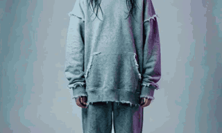
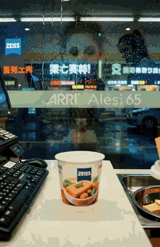

# 案例：同一段故事，本地草稿档 vs 云端成片档

> 以下两条成片均由 OpenShorts · 开片（AI 短剧线，复用 agency-orchestrator 短剧流水线）实际生成；每条标注出片方与模型。

**故事**：深夜便利店，值夜班的女孩把最后一份关东煮留给每天来但从不说话的流浪老人；今晚老人没来，她把关东煮放在门口，转身发现老人在玻璃外看着她笑。
**题材** 治愈日常 · **风格** 霓虹赛博电影 · **画幅** 16:9 · **流程** 编剧写三镜剧本 → 主角定妆图 → 三镜提示词（5 段式）→ 以定妆图为首帧图生视频 ×3 → 看图验收 → ffmpeg 合成

| | 本地草稿档 | 云端成片档 |
|---|---|---|
| 预览 |  |  |
| 成片 | [local-draft-q2.mp4](local-draft-q2.mp4)（7.0 s） | [cloud-agnes.mp4](cloud-agnes.mp4)（13.4 s，已压缩） |
| 出片 | `local-sdcpp` · MiniMax-H3 裁剪版 UD-Q2_K_XL（stable-diffusion.cpp，Metal） | Agnes AI · `agnes-video-2.5-flash` 720P（图生视频 keyframe） |
| 定妆图 | Agnes `agnes-image-2.0-flash` | Agnes `agnes-image-2.0-flash` |
| 每镜 | 640×384 · 2.33 s · 4 步 | 720P · 4 s |
| 机器 / 耗时 | M2 Max 32 GB，三镜串行各约 4–7 分钟（含排队），整条 25 分钟 | 云端，每镜 60–110 s，整条约 5 分钟 |
| 花费 | **0 元**（本机算力） | Agnes 当期免费额度（正常按秒计费） |
| 验收（看图，Agnes 2.0-flash） | 定妆图 ✅；shot1 ✅；shot3 ⚠️「没出现老人」 | shot2 / shot3 ⚠️「杯子上有文字」（剧情内文字，规则已改为只拦叠加字幕/水印） |
| 画质 | 2-bit 草稿：主体与服装跟定妆图一致，动作/场景拖影明显，双人构图撑不住 | 可发布级：人物、环境、光影完整 |
| 用途 | 验证方向、抽卡、不花钱试提示词 | 出成片 |

**单镜重出**：对本地版的 shot3 提意见「玻璃内外两人目光相接」，只重跑 shot3（457 s）+ 合成，其余 8 步复用；验收员判新片「只看到老人，没看到女孩」——草稿档的上限，成片切云端。

**复现**：界面选「AI 短剧」→ 输入故事 → 第 2 步选档位 → 看花费 → 出片；命令行等价：
```bash
openshorts drama --plan -i story="…" -i genre=治愈日常 -i style=霓虹赛博电影 \
  -i image_provider=agnes -i image_model=agnes-image-2.0-flash \
  -i video_provider=local-sdcpp -i video_model=minimax-h3-q2 -i video_resolution=640x384 -i video_duration=2   # 本地
# 云端：-i video_provider=agnes -i video_model=agnes-video-2.5-flash -i video_resolution=720P -i video_duration=4
```
素材与模型许可：MiniMax-H3 Community License（本地权重）；Agnes AI 服务条款；人物为 AI 生成，非真人。
