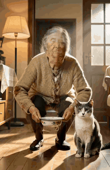
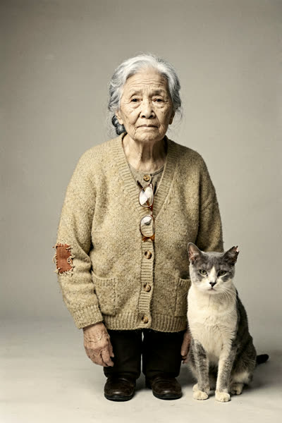
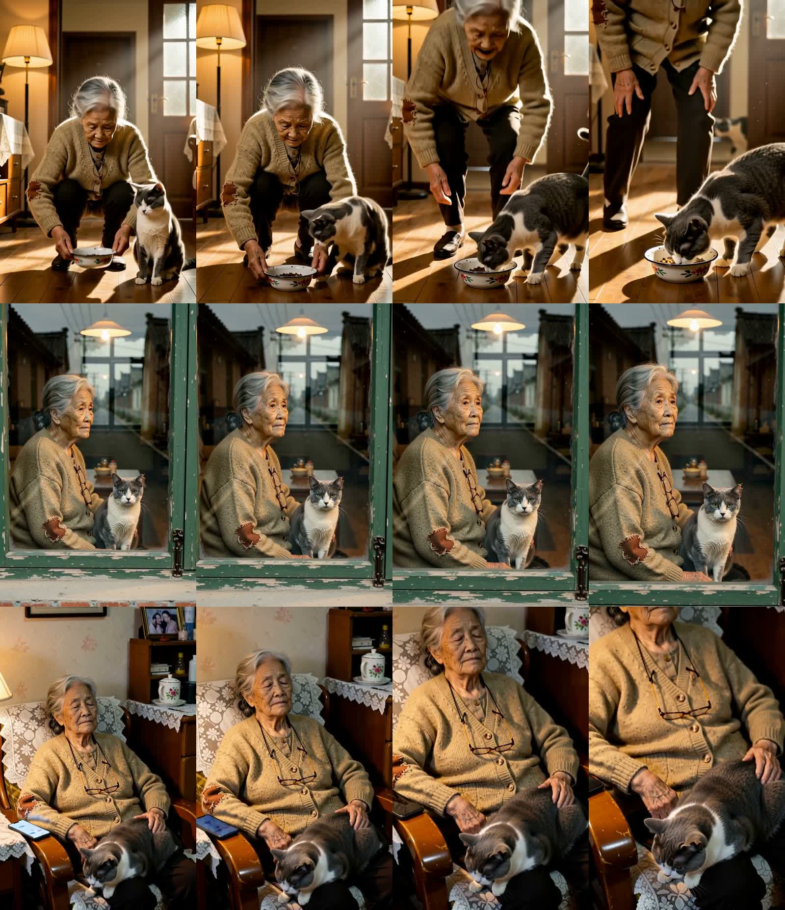

# 案例：从一条提示词模板到三镜成片——《留下来的那个》

> 以下成片由 OpenShorts · 开片（AI 短剧线，复用 agency-orchestrator 短剧流水线）实际生成。
> 故事、人物外形与画质块取自 [ai-shortfilm-prompts 的「奶奶与猫」模板](https://github.com/jnMetaCode/ai-shortfilm-prompts/blob/main/templates/elderly-cat-companion.zh.md)——这条演示「提示词写好之后，片子怎么出来」。

**故事**：空巢奶奶独自住在老公寓；秋天一只流浪猫在门口张望，她放下搪瓷食盆把它留下；夏天一老一猫坐在窗边望着空荡的马路；又一个秋天，老猫蜷在打盹的奶奶腿上，边柜上的手机亮了一下又熄灭。
**题材** 治愈日常 · **风格** 模板第 3 段原文（ARRICAM + Cooke S4 + Kodak Vision3 250D，全片锁一档暖调）· **旁白** 不配（模型自带同期声）

| 预览 | 定妆图 |
|---|---|
|  |  |

| | |
|---|---|
| 成片 | [cloud-agnes.mp4](cloud-agnes.mp4)（13.4 s，已压缩，含同期声） |
| 出片 | Agnes AI · `agnes-video-2.5-flash` 720P · 每镜 4 s（图生视频，三镜同一张定妆图做首帧） |
| 定妆图 / 文本 | Agnes `agnes-image-2.0-flash` / `agnes-2.0-flash` |
| 耗时 | 三镜串行出片各 265–334 s，出片段约 15 分钟（不含下面说的限流重试） |
| 花费 | Agnes 免费额度，按秒计费（12 秒出片）；准确扣费以 Agnes 控制台为准 |
| 验收（看图） | 三镜 ✅「同一个人物、无叠加字幕」 |



## 哪里行、哪里不行

- ✅ **一致性**：三镜是同一个奶奶（燕麦色开衫、左肘补丁、挂绳眼镜）和同一只灰白猫，暖调没有漂。关键是**把猫也放进了定妆图**——三镜首帧都带着它。
- ✅ **动作到位**：镜 1 放下搪瓷食盆、猫凑上来吃；镜 2 窗框里一老一猫望着马路；镜 3 打盹、猫在腿上、扶手上的手机亮着。
- ⚠️ **画幅**：请求 16:9，实际出的是 **704×1088 竖屏**——Agnes 跟着竖版定妆图（1024×1536 请求、实出 832×1248）走了，没照 ratio。要横屏，定妆图得先出横版。
- ⚠️ **镜 1 后半段**：镜头下摇，奶奶的头出了画。
- ⚠️ **猫不够"清瘦"**，耳尖缺口也看不出——外形锁定只锁住了毛色。
- ⚠️ 镜 2 提示词写的是「窗玻璃上的倒影」，模型拍成了隔窗平视——效果反而更好，但不是提示词的字面。

## 第一次为什么翻车（照实记）

1. **编剧自由发挥**：流水线要求主角写「两处瑕疵（磨损/尘土/伤痕）」，温情题材下编剧给奶奶加了"袖口面粉、手上旧伤"，定妆图画成了满身黄渍、手像受伤；还把缺耳灰白猫改成了三花。
   **修法**：在故事里写一段「外形锁定，照抄不要改」，把模板第 2 段的人物描述原样塞进去，并写明"双手干净，不要伤痕污渍"。
2. **免费档限流**：流水线默认并发 3，Agnes 免费档一路 429；视频任务创建时还撞上 503「video queue is full」。文本步骤会自动退避重试，**视频创建失败不会重试**（也不扣费）。
   **修法**：工作流并发改 1，出片失败后 `--resume last --from shot1` 只重跑出片，剧本/定妆图/提示词复用。

## 实际喂给出片模型的三镜提示词（节选【分镜】）

```
镜1  0-1.5s：奶奶蹲下，双手将搪瓷食盆轻放木地板，猫靠近食盆
     1.5-3s：奶奶直起身退半步，轻声唤"过来"，猫低头嗅食盆边缘
     3-4s：镜头缓缓推向食盆，画面收束于食盆与门口影子
镜2  0-4s：窗边，奶奶与猫并排静坐，目光投向空荡马路，远处无车灯掠过；等待落空后的沉默静止
镜3  0-2s：固定，奶奶闭眼打盹，手搭在腿上，猫蜷卧；手机屏幕亮起一秒又熄灭
     2-4s：慢推下摇，极浅景深聚焦奶奶手纹与猫起伏的背，画面缓缓沉向黑场
```

每镜另有【核心主题】【人物与设定】【氛围与画质】【运镜规则】【声音】四段，结构即 ai-shortfilm-prompts 的 5 段式。

**复现**：
```bash
openshorts drama --plan -i story="<故事>。【外形锁定，照抄不要改】奶奶：…；猫：…" \
  -i genre=治愈日常 -i style="<模板第 3 段氛围与画质>" \
  -i image_provider=agnes -i image_model=agnes-image-2.0-flash \
  -i video_provider=agnes -i video_model=agnes-video-2.5-flash -i video_resolution=720P -i video_duration=4
```
免费档被限流时：把工作流 `concurrency` 改为 1 再跑，出片失败用 `--resume last --from shot1` 续。

素材与模型许可：Agnes AI 服务条款；人物与猫均为 AI 生成，非真人。故事与人物设定来自 ai-shortfilm-prompts（MIT）。
