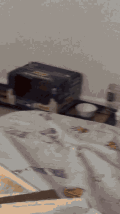

# 案例：口播科普《猫为什么总爱钻纸箱》——0 元、0 个 key

> 由 OpenShorts · 开片（口播线）实际生成。**没有注册任何 API key**：素材来自 Wikimedia Commons（CC，免 key），配音 Edge TTS（免费），合成本机 ffmpeg；脚本由 deepseek 写（几分钱，用户自己的 key）。



[cat-box-zero-key.mp4](cat-box-zero-key.mp4)（36.5 s，1080×1920 压缩版）· [SRT](cat-box-zero-key.srt)

**流程**：话题 → 脚本（钩子 / 4 要点 / 收尾，每段带画面意图 + 英文检索词）→ Edge TTS 词级时间戳 → 每段 3 条素材候选 → **看图排序**（Agnes 2.0-flash 按画面意图打分）→ 分段渲染 → 拼接 → 字幕 → 响度归一 → 质检。出片 101 s（含下载候选）。

**看图排序的实际判断**（模型原话）：
- 素材候选看图排序：agnes / agnes-2.0-flash
- hook 候选 wikimedia=6 wikimedia=2 wikimedia=0 → 选 wikimedia:59471454（有纸箱和猫，光线昏暗氛围接近，但单帧无法确认猫躲在箱内只露眼睛）
- s1 候选 wikimedia=6 wikimedia=2 → 选 wikimedia:50264374（主体是猫且在类似箱子的容器里，但猫未只露眼睛，行为与意图部分匹配）
- s2 候选 wikimedia=7 wikimedia=1 wikimedia=1 → 选 wikimedia:57045743（黑暗环境从下方向上看的视角，接近从纸箱内部向外看的氛围，但缺少人腿元素）
- 镜头 s4 的 2 条候选都不贴合画面意图（1/1），退纯色底
- 镜头 outro 的 2 条候选都不贴合画面意图（1/1），退纯色底

**实际画面效果（如实说）**：6 镜里 2 镜贴合（猫在纸箱旁、猫舔毛），2 镜勉强（一块高尔顿板被判成"从箱内向上看"、一张 1930 年猫卡通的片头字幕卡），2 镜退纯色。免 key 的 Wikimedia 是兜底不是主力——它的检索是全文匹配、素材以科教/历史片为主；配一把免费 Pexels key 后这类口播片的画面会明显好一截。看图排序把最离谱的（量子图表）拦住了，但单帧判断对"视角/氛围"仍会放水。

最后两镜的候选是"量子态 Wigner 分布"动图（Wikimedia 全文检索把 "cat states" 当猫），验收员打 1 分全部退掉、用了纯色底——**宁可空着也不放错图**。注册免费 Pexels key 后这两镜会有真素材。

**素材署名（CC 许可要求）**

| 镜头 | 许可 | 来源 · 作者 |
|---|---|---|
| hook | CC BY-SA 4.0 | [Housecat_Grooming_Itself.webm](https://commons.wikimedia.org/wiki/File:Housecat_Grooming_Itself.webm) · Thebombzen |
| s1 | CC BY-SA 4.0 | [Cat_lapping_water_off_ground_in_slow_motion.gk.webm](https://commons.wikimedia.org/wiki/File:Cat_lapping_water_off_ground_in_slow_motion.gk.webm) · Grendelkhan |
| s2 | CC BY 3.0 | [How_a_Wind_Up_Music_Box_Works.webm](https://commons.wikimedia.org/wiki/File:How_a_Wind_Up_Music_Box_Works.webm) · engineerguy |
| s3 | Public domain | [Felix_The_Cat_In_Forty_Winks_(1930)_-_Sleep_Tight,_Felix.webm](https://commons.wikimedia.org/wiki/File:Felix_The_Cat_In_Forty_Winks_(1930)_-_Sleep_Tight,_Felix.webm) · Copley Pictures |
| s4 | CC BY-SA 4.0 | [Wigner_quasiprobability_distribution_of_cat_states,_grid.webm](https://commons.wikimedia.org/wiki/File:Wigner_quasiprobability_distribution_of_cat_states,_grid.webm) · Cosmia Nebula |
| outro | CC BY-SA 4.0 | [Wigner_quasiprobability_distribution_of_cat_state,_n_%3D_10,_a_%3D_10.webm](https://commons.wikimedia.org/wiki/File:Wigner_quasiprobability_distribution_of_cat_state,_n_%3D_10,_a_%3D_10.webm) · Cosmia Nebula |
| hook | CC BY 3.0 | [Cat_jumping_backwards.webm](https://commons.wikimedia.org/wiki/File:Cat_jumping_backwards.webm) · Mary Qin |
| s1 | CC BY-SA 4.0 | [Housecat_Grooming_Itself.webm](https://commons.wikimedia.org/wiki/File:Housecat_Grooming_Itself.webm) · Thebombzen |
| s2 | CC BY-SA 4.0 | [Galton_box.webm](https://commons.wikimedia.org/wiki/File:Galton_box.webm) · Exhibit made by Estes Objethos Atelier, video by Rodrigo.Argenton |
| s3 | Public domain | [Felix_The_Cat_In_Forty_Winks_(1930)_-_Sleep_Tight,_Felix.webm](https://commons.wikimedia.org/wiki/File:Felix_The_Cat_In_Forty_Winks_(1930)_-_Sleep_Tight,_Felix.webm) · Copley Pictures |

**自动质检**
- ✅ 1080×1920（要求 1080×1920）
- ✅ 成片 36.5s，各镜配音之和 37.6s（偏差 3%）
- ✅ aac 96000Hz
- ✅ 综合响度 -17.6 LUFS（目标 -16 ±3）
- ⛔ 字幕没有烧进画面（当时那台机器的 ffmpeg 缺 libass）——**这条片实际上看不到字**
- ✅ 有封面
- ✅ 元数据含 AI 生成标识
- ✅ 6/6 镜头就绪
- ⚠️ 2 个镜头是纯色底（没找到素材）

> **这条案例暴露了两个真问题，都已在代码里修掉，但本页的成片是修之前跑的，先如实标着：**
>
> 1. **成片没有可见字幕。** 出这条片的机器上 `brew install ffmpeg` 装的 ffmpeg 不含 libass，
>    字幕只能挂软轨，而抖音/视频号一律不认软轨。上面 2 个退纯色底的镜头因此就是**纯黑屏**。
>    现在 `openshorts doctor` 会把这一条判成 ⛔（不再是提醒），质检里 `captions` 也从 warn 升为 fail，
>    并给出 `openshorts install-ffmpeg` 一键装一份带 libass 的。
> 2. **s3 那段 1920 年代动画的英文标题卡本不该入选。** 看图排序当时只在"候选 ≥ 2 条"时才启动，
>    而这一镜只有 1 条候选，直接放行了——"唯一候选"恰恰是最该把关的情况。另外抽帧固定取第 1 秒，
>    正好是片头标题卡。现在改成：**候选只有 1 条也要打分**，且**抽正片中段**而不是第 1 秒。
>
> 重跑（`openshorts run <project.json>`）即可得到带字幕的版本；这一页会在重跑后换成新成片。

**复现**
```bash
openshorts new koubo-kepu --topic "猫为什么总爱钻纸箱" --duration 45秒 --voice zh-CN-YunxiNeural
openshorts run ~/OpenShorts/猫为什么总爱钻纸箱/project.json --vision-provider agnes --vision-model agnes-2.0-flash
```
