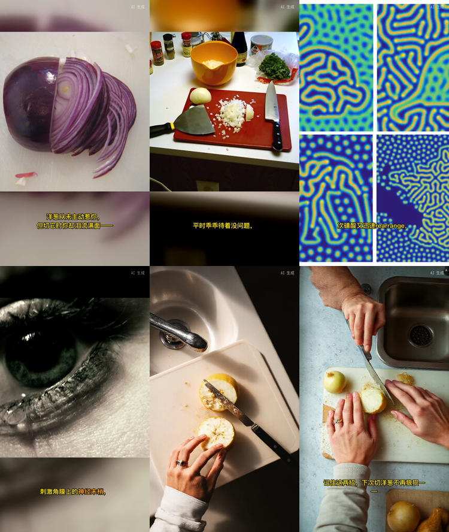
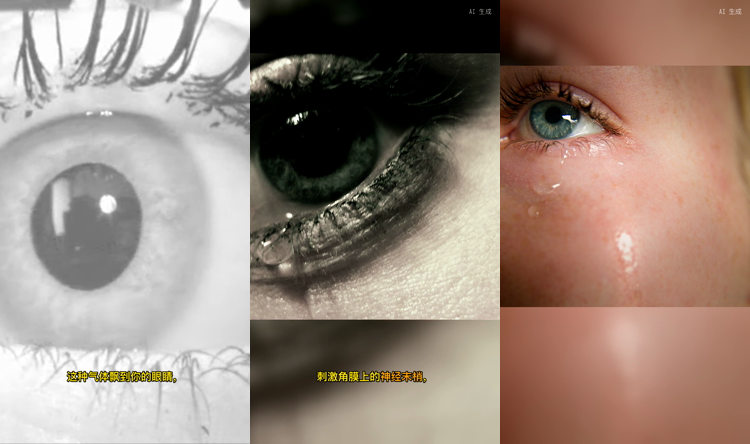

# 《为什么切洋葱会流眼泪》· 口播科普 · 0 元 0 key

一条 60 秒的竖版口播科普，**全程没有付费 API**：文案模型用的是你自己的 key（这里是 Agnes，
换 DeepSeek 一样跑），画面来自 CC 素材库和**本机文生图**，配音 Edge TTS，合成本机 ffmpeg。


[完整成片 60 秒](onion-60s.mp4) · [字幕 SRT](onion-60s.srt)

## 数据

| | |
|---|---|
| 成片 | 60.3 秒 · 1080×1920 · 质检 8 项全过、0 条提醒 |
| 目标时长 | 60 秒（脚本 278 字，实际 60.3 秒，差 0.5%） |
| 花费 | **0 元**（Edge TTS 免费 · CC 素材免费 · 本机出图免费 · 合成本机 ffmpeg） |
| 出片耗时 | 347 秒（其中 2 镜本机出图，各约 56 秒） |
| 画面节奏 | 6 镜切成 **11 段，平均 5.5 秒换一次画面**（不切镜头时是 10.1 秒） |

## 六镜



| 镜 | 画面来源 | 切段 |
|---|---|---|
| hook | Openverse CC 照片 | 2 段 |
| s1 | Openverse CC 照片 | 2 段 |
| s2 | Commons CC 图 | 2 段（其中 1 段取同一条素材的不同时间点） |
| s3 | Openverse CC 照片 | **3 段**（三张不同的眼睛特写） |
| s4 | **本机 FLUX 生成** | 1 段 |
| outro | **本机 FLUX 生成** | 1 段 |

`s3` 那一镜 11.8 秒，切成三段是三张不同的眼睛特写——黑白虹膜、睫毛特写、含泪的眼：



## 这条片子想说明的三件事

**1. 素材库没货时，本机现画一张，而不是退纯色底。**
`s4`（"冰箱冷藏十分钟，低温让酶活性降低"）和 `outro` 的候选素材全部没过看图把关，
于是交给本机 FLUX.1-schnell 出图（Apache-2.0，可商用）。这是检索类工具做不到的：
洋葱这种题材，素材库里就是没有对应画面。

**2. 画面是被模型看过才用的。** 每条候选抽一帧交给能看图的模型按"画面意图"打 0–10 分，
≥6 才能当主画面、4–5 只能补切段、<4 判退。没有这一关的话，字面匹配会把不相干的东西配进来
——同一套流程在猫的选题上，曾经把一段**黄蜂吃猫粮**和一口**铜钟**配进过成片。

**3. 每一条素材都有署名。** 发布文案里逐镜列出来源、作者、许可证和原页面地址，
CC BY-SA 要求的署名一条不少（这条片子 10 条）。同一条素材换时间点不算新来源，不重复记。

## 已知瑕疵（如实标着）

- `s2` 的口播里有一个英文词 `rearrange`（"次磺酸又迅速 rearrange"）。Edge TTS 会照着念出
  一个英文词，字幕上也是一串拉丁字母，中文科普片里很出戏。这条脚本是在加"口播必须是能直接
  朗读的中文"这条规则**之前**写的；现在同样的输出会被 `scriptWarnings` 报出来。
- 脚本长度靠提示词约束**不完全可靠**：同一个话题两次生成分别是 278 字（这条，落在 60 秒的
  243–297 区间内）和 183 字（短 32%）。现在偏离超过 12% 会在 CLI 和质检里报出来，
  重新生成一次通常就对了。

## 复现

```bash
# 侧栏或 config 里配好文本模型与看图把关的模型，再装本机出图模型（6.4 GB，Apache-2.0）
openshorts install-image --model flux-schnell-q2

openshorts new koubo-kepu --topic "为什么切洋葱会流眼泪" --duration 60秒 --tone 科普讲解
openshorts run ~/OpenShorts/为什么切洋葱会流眼泪/project.json
openshorts export ~/OpenShorts/为什么切洋葱会流眼泪/project.json --platform douyin
```

素材与打分每次都会变（检索结果和模型评分都不是确定性的），所以复现出来的片子不会逐帧相同，
但流程、花费和质检口径是一样的。
